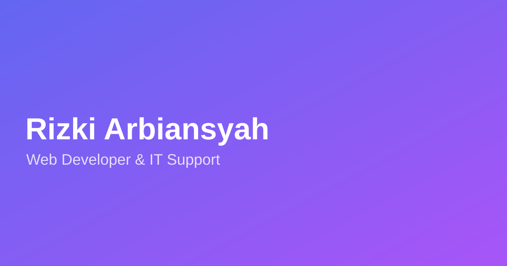

# Portofolio V3

Portofolio website bertenaga **Next.js 15**, **TypeScript**, dan **Tailwind CSS** dengan desain **neo-brutalism** — mengambil referensi dari [aulianza.com](https://aulianza.com/id).



## ✨ Fitur

- 🎨 **Neo-brutalism design** — border tebal, hard shadow, palet indigo → ungu
- 🌙 **Dark / Light mode** dengan toggle
- 📝 **Blog** dengan MDX dan remark rendering
- 💼 **Halaman detail proyek** dengan SEO metadata dinamis
- 📱 **Fully responsive** — hamburger menu di mobile
- 📊 **GitHub stats** & skill section
- 📬 **Contact form** via FormSubmit
- 🔍 **SEO** — sitemap, robots.txt, OpenGraph, JSON-LD-ready

## 🛠️ Tech Stack

- **Framework:** [Next.js 15](https://nextjs.org) + React 18
- **Bahasa:** TypeScript
- **Styling:** Tailwind CSS 3 + Custom neo-brutalism shadow
- **Icons:** react-icons
- **Content:** MDX via gray-matter + remark
- **Font:** Brakle (display) & Onest (body)

## 🚀 Cara Menjalankan

```bash
# Install dependencies
npm install

# Development
npm run dev

# Build production
npm run build

# Jalankan production build
npm start
```

## 📁 Struktur Folder

```
src/
├── app/                    # Routes & halaman
│   ├── about/
│   ├── blog/[slug]/
│   ├── projects/[slug]/
│   ├── contact/
│   └── layout.tsx          # Root layout
├── common/
│   ├── components/         # Sidebar, layouts, elemen UI
│   ├── constant/           # Data (profil, proyek, pengalaman)
│   ├── context/            # ThemeContext
│   └── libs/               # blog.ts, github.ts, projects.ts
├── modules/                # Komponen per-fitur (home, blog, stats, dll)
└── lib/                    # utils
content/
└── blog/                   # Artikel MDX
public/
├── fonts/                  # Brakle & Onest fonts
└── images/                 # Gambar proyek
```

## 📝 Kustomisasi

Semua data konten (profil, proyek, pengalaman, sertifikasi, skill) ada di:

- `src/common/constant/data.ts` — profil & info situs
- `src/common/constant/projects.ts` — proyek
- `src/common/constant/experience.ts` — pengalaman & edukasi
- `src/common/constant/services.ts` — layanan & skill

Artikel blog ditulis di `content/blog/*.mdx`.

## 🧑‍💻 Author

**Rizki Arbiansyah** — Web Developer & IT Support

© 2026 Rizki Arbiansyah
